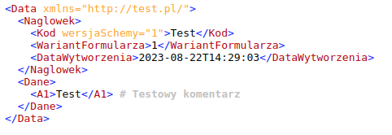

# Install
```bash
composer require krzysztofzylka/xml-view-generator
```

# Render beautifully XML
```php
$xml = new \Krzysztofzylka\XmlViewGenerator\XmlViewGenerator();
$xml->loadXmlData('
<Data xmlns="http://test.pl/">
  <Naglowek>
    <Kod wersjaSchemy="1">Test</Kod>
    <WariantFormularza>1</WariantFormularza>
    <DataWytworzenia>2023-08-22T14:29:03</DataWytworzenia> 
  </Naglowek>
  <Dane>
    <A1>Test</A1>
  </Dane>
</Data>
');
$xml->setNodeDescriptions([
    'A1' => 'Testowy komentarz'
]);

echo $xml->render();
```
## Example:

# Methods
## Load XML from string
```php
$xml->loadXmlData('string');
```
## Load XML from file
```php
$xml->loadXmlFile('file_path');
```
## Node descriptions
```php
$xml->setNodeDescriptions(['node_name' => 'description', ...]);
```
## Load mode descriptions from XSD file
```php
$xml->loadNodeDescriptionsFromXSD('file_path');
```
## Render beautifully XML
```php
echo $xml->render();
```